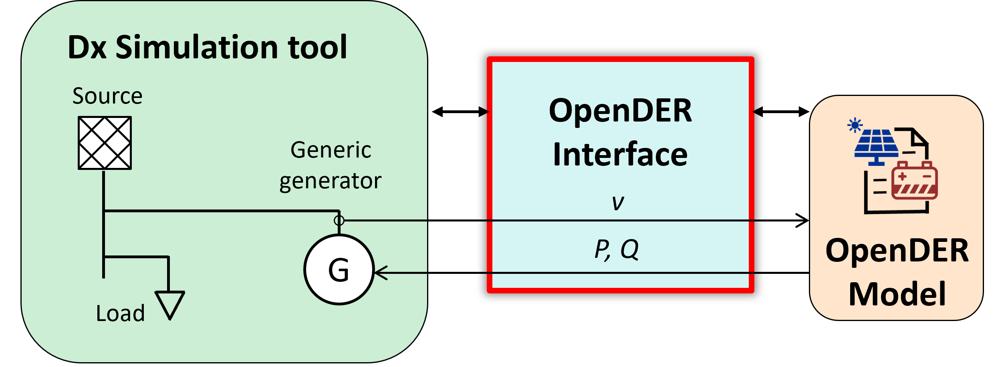
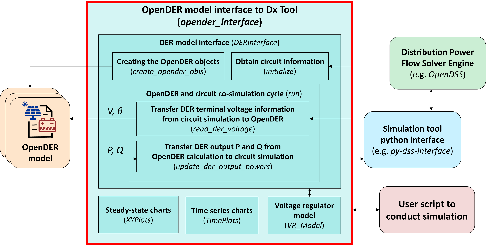

=================
OpenDER interface
=================

Introduction
============
This is the interfaces designed for `OpenDER <https://github.com/epri-dev/opender/>`__ model, aiming to establish
connections with power system simulators for steady-state or dynamic studies. This package is designed to be used as an
intermediate solution to analyze impact of IEEE 1547-2018 compliant DER to the distribution circuit.
Current version offers support for interfacing with OpenDSS.

The same as OpenDER model, this package is also licensed under the terms of the BSD-3 clause license.

The operating principle of the package is as shown below.
The OpenDER is represented as a generic generator or DER model in the circuit simulation engine. This model interface
transfers voltage, active power and reactive power between the circuit simulation tool and the OpenDER model to
facilitate the co-simulation.

Modules
=======
This package include the following function modules:

* OpenDER interface (DERInterface) with distribution system simulators. Currently the interface to OpenDSS is
  released. The interface to other simulation tool, such as CYME or Synergi is planned.
* Time series charts (TimePlots) to plot simulation results with x-axis as time.
* Steady-state charts (XYPlots) to plot steady-state DER operational status, including voltage-reactive power,
  active power-reactive power, frequency-active power, etc.
* Voltage regulator model (VR_Model) external to the circuit simulation tool to all dynamic / time series simulation

Selected major module and methods are shown below.

Installation
============
**Users are encouraged and expected to make changes to this package for their usage.**

To encourage modifications and changes to this OpenDER model interface, this package is not currently released as a
package on PyPI for user to directly download and install.

To use it, please install the package locally using the following command at the root directory, where 'setup.py'
resides. Dependencies will be automatically installed:

    ``pip install -e ./``

Examples
=========
Jupyter Notebook examples can be found `here <Examples/Jupyter_notebook_examples/>`__

Other Python scripts are in the Example folder `here <Examples/>`__

* plot_volt-var: demonstrate plotting capabilities
* OpenDSS_34bus/steady_state_simulation: steady-state power flow solution, plotting voltage and power flow profile
  comparing with and without DERs
* OpenDSS_34bus/dynamic_simulation: interactions between voltage regulators and DER enter service performance
* OpenDSS_VR_VV: dynamic simulation demonstrating the impact volt-var settings on system operation
* OpenDSS_GFOV/single_isource: dynamic simulation of isource experiencing a ground fault over-voltage
* OpenDSS_GFOV/single_vsource: dynamic simulation of vsource experiencing a ground fault over-voltage
* OpenDSS_BESS_PV: 15min time series simulation using BESS for PV power peak shaving

